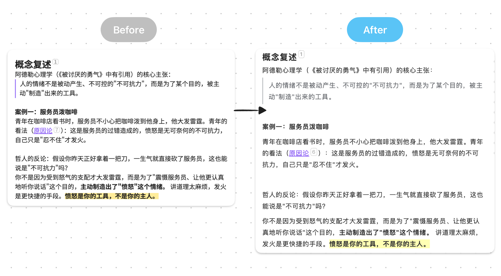
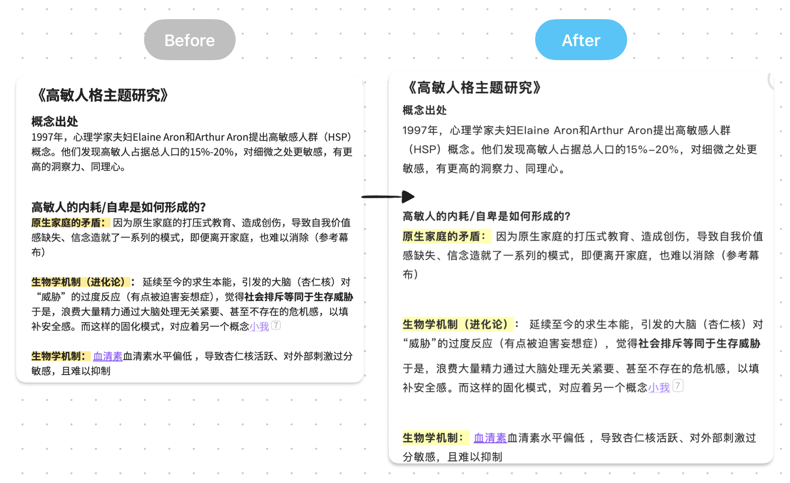
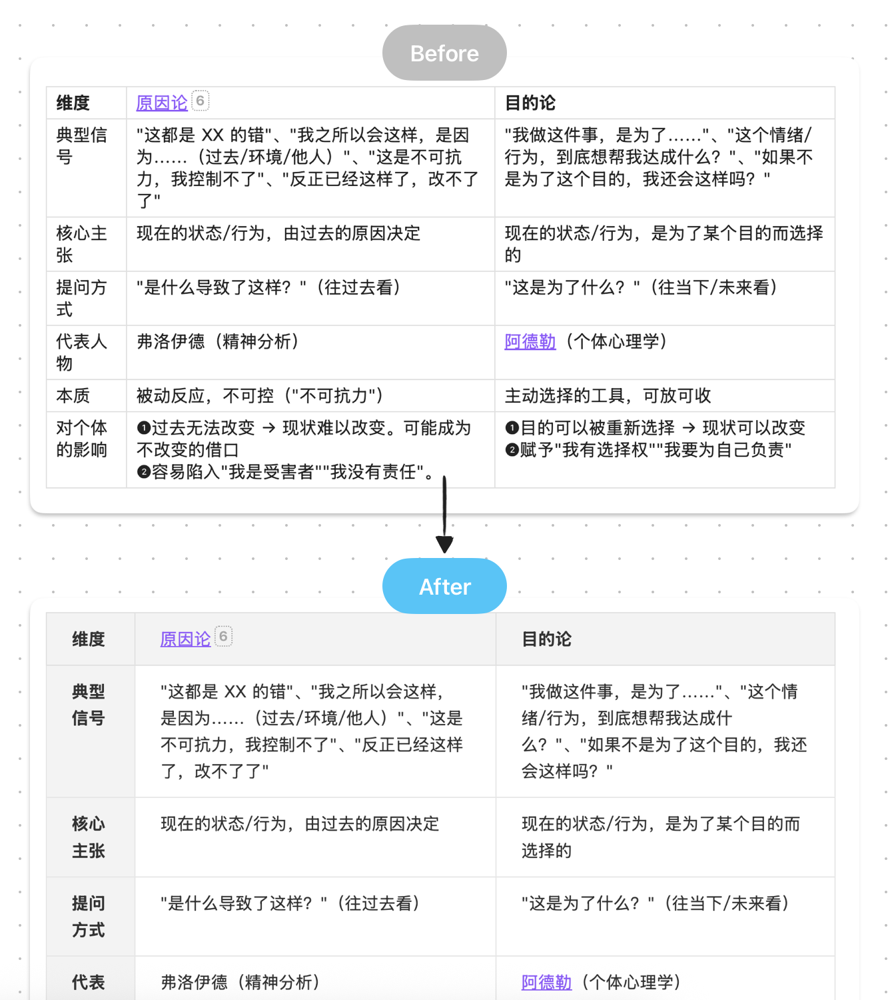
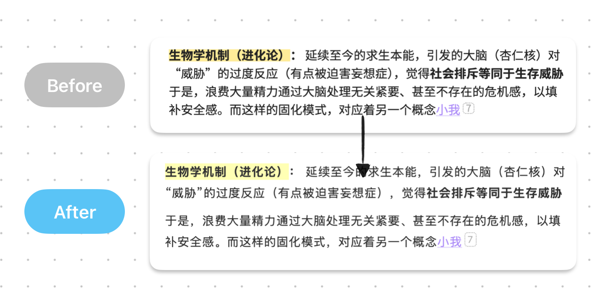

# Obsidian Quiet Notes

一个为 Obsidian 中文写作、日常记录和轻量卡片阅读设计的 CSS Snippet。

[English README](README.en.md)

Quiet Notes 不是完整的 Obsidian 主题，也不是插件。它是一段轻量 CSS，用来调整正文排版、段落间距、标题节奏、表格、高亮、引用块，以及浅色 / 深色模式下的基础颜色变量。

它的设计原则是：**只改变笔记正文的阅读和书写体验，尽量不影响 Obsidian 本身的界面结构。**

## 适合谁

- 经常在 Obsidian 里写中文长文、日记、卡片笔记的人
- 希望正文阅读更安静、更松弛、更适合中文排版的人
- 想轻量改造 Obsidian，但暂时不想更换完整主题的人
- 想直接看懂、修改、二次调整 CSS 的人

## 特性

- 更适合中文阅读的字号、行高和段落节奏
- 更清晰的标题层级
- 更干净的表格样式
- 更柔和的高亮和引用块
- 同时包含浅色和深色模式变量
- 排版规则限定在笔记正文区域，避免影响侧边栏和 Obsidian 界面组件

## 安装方式

### 推荐：用 Agent 安装

如果你已经在使用 Codex、Claude Code、Cursor、Gemini CLI 或其他本地 Agent，可以直接把下面这段话复制给你的 Agent：

```text
请帮我安装这个 Obsidian CSS Snippet：https://github.com/andrewchen0623/obsidian-quiet-notes
```

Agent 会根据 README 自己读取安装方式。你只需要最后在 Obsidian 设置里刷新并启用 `quiet-notes`。

### 手动安装

1. 下载 `quiet-notes.css`。
2. 打开你的 Obsidian 仓库文件夹。
3. 把 `quiet-notes.css` 复制到：

```text
.obsidian/snippets/
```

4. 打开 Obsidian 设置：`Settings` -> `Appearance`。
5. 找到 `CSS snippets`。
6. 点击刷新按钮，然后启用 `quiet-notes`。

如果你的 `.obsidian` 目录下没有 `snippets` 文件夹，可以手动创建一个。

## 截图

### 整体阅读效果



### 长文与高亮



### 表格



### 局部细节



## 文件说明

- `quiet-notes.css`：主 CSS Snippet 文件
- `README.en.md`：英文说明
- `assets/screenshots/`：截图示意

## 说明

这个项目目前会保持轻量、直观、易修改。它不是 Obsidian 社区插件，也暂时不是 Obsidian 社区主题。

如果后续有更多人使用，并且确实需要一键安装或更完整的主题适配，Quiet Notes 可能会继续升级成完整的 Obsidian Community Theme。

## 贡献者

- Andrew：样式设计、使用体验和项目维护
- OpenAI Codex：项目整理、文档协作和开源发布

## 开源协议

MIT
